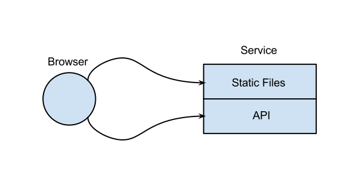
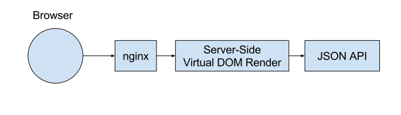
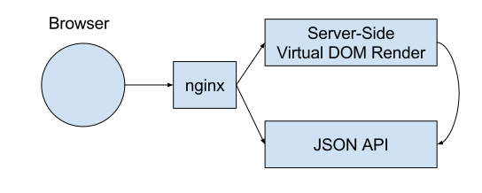
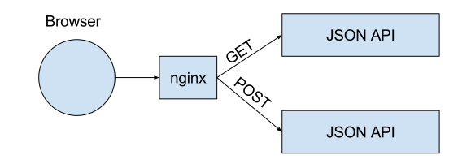
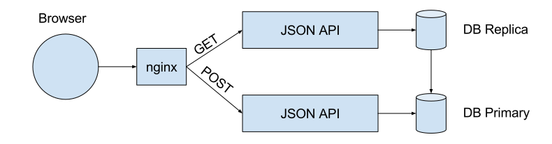
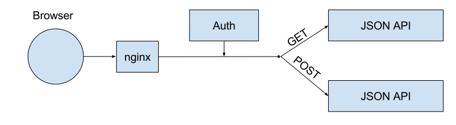

.. role:: fragment
   :class: fragment
.. role:: strike
   :class: kill

Microservices :fragment:`from day 1`
====================================

Hard? :fragment:`yes`
=====================

Scary? :fragment:`no`
=====================

Scary?
======

Microservices aren't particularly hard to build, but they are brittle as hell.

Substantial DevOps Skills Required
==================================

Scary?
======

Due to distributed deployment, testing can become complicated and tedious

Solution? :fragment:`no way`
============================

What is a Microservice?
=======================

* Small codebase
* Independent operation
* Separate release cycle

SOA Design Implies
==================

* Lots of services (+orchestration)
* Backwards compatibility

Quasi-services
==============

Sorry what?
===========

Quasi-service
=============

* Probably same repo
* Small codebase
* Independent operation
* Common release cycle

Quasi-service
=============

* Small unit
* Not a microservice
* Ready to split

SPA
===

SSR
===

SSR
===

Get/Post
========

Get/Post+DB
===========

Auth
====

How?
====

Bad Advices
===========

* LoC
* URIs
* Python modules

How?
====

* Scalability
* Availability

Ex: News Site
=============

* Visitors
* Admin

Ex. Ecommerce
=============

* Catalog
* Shopping cart
* :fragment:`Remaining`

Tools
=====

1. Configuration
2. RPC
3. Supervisor

Configuration
=============

* Non-python
* Readable (:strike:`JSON`)
* Validation

RPC
===

* Simple
* MesssagageBus(???)
* Validation

Supervisor
==========

* Run all
* Detect crashes
* Containers (???)

A Link
======

http://engineering.evo.company/2016/01/03/new-projects/
